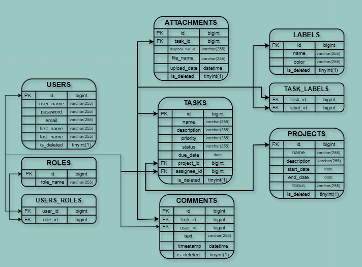

<h1 align="center" style="display: block; font-size: 1em; font-weight: bold; margin-block-start: 0.5em; margin-block-end: 1em;">
<picture>

</picture>
<br /><br /><strong>Task management system</strong>
</h1>

<div>

# Introduction

---

### **What inspired me to create this project?**

The primary inspiration for developing this project was to gain hands-on experience with Spring Boot and working with APIs. I aimed to create a task management application that enables effective organization of projects and tasks among team members. This tool allows users to assign tasks to developers, add new members to projects, and provide a centralized platform for sharing information through comments on tasks. The ability to add comments can help team members communicate effectively and resolve issues more quickly. Additionally, the app includes a feature for uploading attachments to Dropbox, making document management simpler and ensuring that necessary resources are readily available to all collaborators.

### **What problems does my project resolve?**

This web application addresses several core challenges in project and task management, especially for collaborative teams. It offers structured organization of tasks and projects, enabling users to prioritize critical tasks and avoid missed deadlines through deadline tracking and automated email reminders. The application simplifies user management, providing role-based access, secure authentication, and the ability to manage team members within projects. It also enhances communication by allowing users to leave comments on tasks, centralizing discussions and relevant information. With Dropbox integration, users can efficiently manage files, ensuring that all necessary resources are readily available. Additionally, label-based task categorization helps users organize tasks based on topics or workflow stages, facilitating better focus and task tracking. Overall, the app streamlines project organization, boosts collaboration, and ensures that deadlines and task priorities are consistently managed.

---

### **What can do roles USERS and ADMINISTRATORS?**

#### *Role: USER*

- Can register an account.
- Can check personal information.
- Can update personal information.
- Can get all projects or get project by id.
- Can get all tasks or get tasks by id.
- Can get all labels for tasks or get labels by id.
- Can write and check comments.
- Can upload attachments and check all attachments.


#### *Role: ADMINISTRATOR*
- Has the ability to add, update, and delete projects, tasks, labels in the system.
- Can update user roles.

</div>

---

<div>

# Technologies and Tools used

---
## Technologies:

### Core Backend Technologies:
- #### <a href="https://docs.oracle.com/en/java/javase/17/docs" target="_blank">  JAVA 17</a>
- #### <a href="https://docs.spring.io/spring-boot/index.html" target="_blank">Spring Boot</a> (v3.3.4)
- #### <a href="https://docs.spring.io/spring-data/jpa/reference/index.html" target="_blank">Spring Data JPA </a> (v3.3.4)
- #### <a href="https://hibernate.org/orm/documentation/6.6/" target="_blank">Hibernate </a>
- #### <a href="https://docs.liquibase.com/home.html" target="_blank">Liquibase </a> (v4.9.1)
- #### <a href="https://tomcat.apache.org/tomcat-8.5-doc/index.html" target="_blank">Tomcat </a> (v3.3.4)

### Security & Authentication:
- #### <a href="https://docs.spring.io/spring-security/reference/index.html" target="_blank"> Spring Boot Security </a> (v3.3.4)
- #### <a href="https://jwt.io/introduction" target="_blank">JSON Web Token </a> (v0.11.5)
- #### <a href="https://www.baeldung.com/role-and-privilege-for-spring-security-registration" target="_blank">Access by roles </a>

### Data Processing & Utilities:
- #### <a href="https://mapstruct.org/" target="_blank">MapStruck </a> (v1.5.5.Final)
- #### <a href="https://projectlombok.org/features/" target="_blank">Lombok </a>
- #### <a href="https://docs.spring.io/spring-boot/reference/io/validation.html" target="_blank">Spring Boot Validation </a>
- #### <a href="https://docs.spring.io/spring-data/rest/reference/paging-and-sorting.html" target="_blank">Paginating & Sorting </a>
- #### <a href="https://www.baeldung.com/spring-jpa-soft-delete" target="_blank">Soft Deleting </a>

### Database:
- #### <a href="https://dev.mysql.com/doc/" target="_blank">MySql 8 </a> (v8.0.33)
- #### <a href="https://docs.spring.io/spring-data/jpa/docs/current/api/org/springframework/data/jpa/repository/JpaRepository.html" target="_blank">JpaRepository </a> (v3.3.4)

### Communication & Documentation:
- #### <a href="https://swagger.io/docs/" target="_blank">Swagger </a> (v2.1.0)
- #### <a href="https://swagger.io/tools/swagger-ui/" target="_blank">Swagger UI </a> (v3.0)
- #### <a href="https://www.baeldung.com/java-email" target="_blank">Email Sender</a>

---

## Development Tools:
- #### <a href="https://maven.apache.org/" target="_blank">Maven </a>
- #### <a href="https://junit.org/junit5/" target="_blank"> JUnit 5 </a>
- #### <a href="https://www.docker.com/" target="_blank"><picture>Docker </a>
- #### <a href="https://testcontainers.com/" target="_blank">Testcontainers </a> (v1.20.0)
- #### <a href="https://www.postman.com/" target="_blank">Postman </a>
- #### <a href="https://www.jetbrains.com/ru-ru/idea/" target="_blank">IntelliJ IDEA </a>
- #### <a href="https://jwt.io/" target="_blank">JWT </a>

---

## Collaboration & Storage
- #### <a href="https://github.com/" target="_blank">GitHub </a>
- #### <a href="https://www.dropbox.com/official-teams-page?_tk=paid_sem_goog_biz_pmax_int20&_camp=21506269140&_kw=|&_ad=||c&gad_source=1&gclid=Cj0KCQiA88a5BhDPARIsAFj595gN3Iacx0oNPcloqk65FsJgbYPbstsshf95S_jUugiAv8i1fnzvxjIaAr1FEALw_wcB" target="_blank">Dropbox </a> (v5.3.0)

</div>

---

<div>

# Functionality of controllers

---

## Authentication Management

| HTTP Request| Endpoint            | Description            |
|-------------|---------------------|------------------------|
| POST        | `/api/auth/registr` | Register a new user    |
| POST        | `/api/auth/login`   | Login an existing user |

##  User Management

| HTTP Request | Endpoint           | Description                             |
|--------------|--------------------|-----------------------------------------|
| PUT          | `/users/{id}/role` | Update user's role                      |
| GET          | `/users/me`        | Get user's personal information         |
| PATCH        | `/users/me`        | Update user's personal information      |

##  Project Management

| HTTP Request | Endpoint             | Description                                  |
|--------------|----------------------|----------------------------------------------|
| POST         | `/api/projects`      | Create project and save to database          |
| GET          | `/api/projects`      | Get all projects for current registered user |
| GET          | `/api/projects/{id}` | Get project by its ID                        |
| PUT          | `/api/projects/{id}` | Update project by its ID                     |
| DELETE       | `/api/projects/{id}` | Delete project from database by its ID       |

## Task Management

| HTTP Request | Endpoint          | Description                         |
|--------------|-------------------|-------------------------------------|
| POST         | `/api/tasks`      | Create task and save to database    |
| GET          | `/api/tasks`      | Get all available tasks             |
| GET          | `/api/tasks/{id}` | Get task by its ID                  |
| PUT          | `/api/tasks/{id}` | Update task by its ID               |
| DELETE       | `/api/tasks/{id}` | Delete task from database by its ID |

## Comment Management

| HTTP Request | Endpoint                 | Description                         |
|--------------|--------------------------|-------------------------------------|
| POST         | `/api/comments`          | Create comment and save to database |
| GET          | `/api/comments/{taskId}` | Get all available comments for task |

## Attachment Management

| HTTP Request | Endpoint                  | Description                                                          |
|--------------|---------------------------|----------------------------------------------------------------------|
| POST         | `/api/attachments/taskId` | Upload new attachments and save its ID and name to database for task |
| GET          | `/api/attachments/taskId` | Get all available attachments for task                               |

## Label Management

| HTTP Request | Endpoint            | Description                          |
|--------------|---------------------|--------------------------------------|
| POST         | `/api/labels`       | Create label and save to database    |
| GET          | `/api/labels`       | Get all available labels             |
| PUT          | `/api/labels/{id}`  | Update label by its ID               |
| DELETE       | `/api/labels/{id}`  | Delete label from database by its ID |

---

<div>

# Database structure

---



</div>

---
<div>

# <picture id = "getting-started-project"></picture> Getting started project

---

## Steps
1. **Prerequisites [Docker](https://www.docker.com/get-started) and [Docker Compose](https://docs.docker.com/compose/install/) on your machine.**
2. **Clone the Repository**
   ```sh
    git clone https://github.com/Dima23-ops5/task-management-app
    ```
3. **Navigate to the project directory**
    ```sh
     cd task-management-app
    ```
4. **Configure Environment Variables**:

- ***Write your date to `.env` file in the project directory to store your database credentials. This file should contain the necessary environment variables, such as `DB_HOST`, `DB_USER`, and `DB_PASSWORD`.***
- ***Update the `application.properties` file located in the `src/main/resources` directory with your specific database connection details and any other necessary configurations.***

5. **Set Up the Environment**:

   Ensure Docker and Docker Compose are installed on your system. You can configure environment variables directly in the `docker-compose.yml` file.

6. **Build and Run the Application**:

    ```sh
    docker-compose build
    docker-compose up
    ```

7. **Access the Application**:

   The application will be available at `http://localhost:8080/`.

</div>

---

<div>

# API Documentation

---

To explore and test the API endpoints, you can use Swagger. Swagger provides interactive API documentation that allows you to test endpoints directly from the browser.

- **[Swagger Documentation](http://localhost:8080/swagger-ui/index.html#/)**

---

<div>

# Testing in Postman

---

- ### Postman collection
[task-management.postman_collection.json](images%2Ftask-management.postman_collection.json)

- ### Short instruction how to use postman collection
You can view the instructional video via this link : https://www.loom.com/share/e17527dd620a4c1b9ad87e425a99ac05?sid=84ca2397-9c43-4914-be17-15dd78c0f7c2

</div>

#  Challenges & Solutions

---

1. **Dropbox API integration**

Integrating the Dropbox API was one of the more challenging aspects of this project. This was my first experience working with a third-party API, and it required a significant investment of time to fully understand how to implement it correctly. Initially, I struggled with understanding the authentication process and the correct way to handle file uploads and retrievals via the API, as this process was new to me.

To overcome these challenges, I dedicated time to thoroughly reviewing Dropbox’s API documentation, which provided valuable details on authentication methods, endpoint usage, and best practices for integration. Additionally, I watched several instructional videos on YouTube, which helped clarify the workflow and provided practical examples of Dropbox API implementation. Through persistence and careful study, I was able to successfully integrate Dropbox into my application, allowing users to upload and access attachments seamlessly within the app. This experience not only enhanced the functionality of the project but also expanded my skillset in working with external APIs, a critical skill for developing more complex applications in the future.
</div>

---

</div>

<div>

# Contacts

---

For any questions or suggestions, feel free to reach out:

- GitHub: [Dima23-ops5](https://github.com/Dima23-ops5)
- email: dmmhnk23@gmail.com

</div> 
